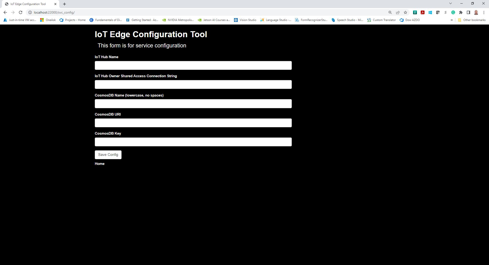
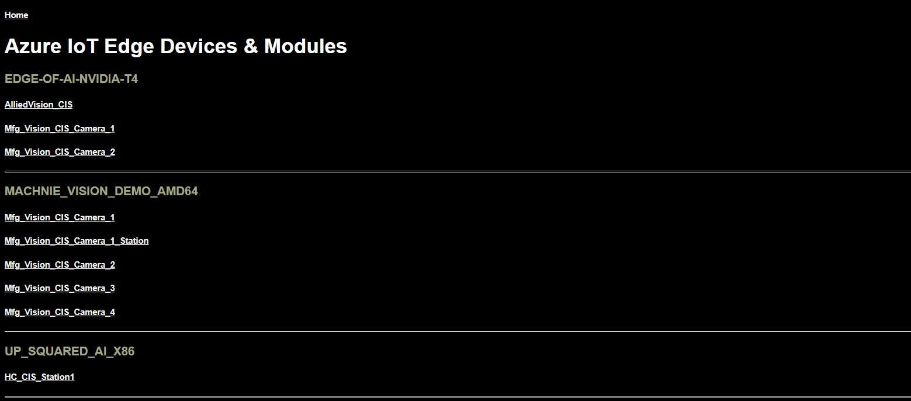
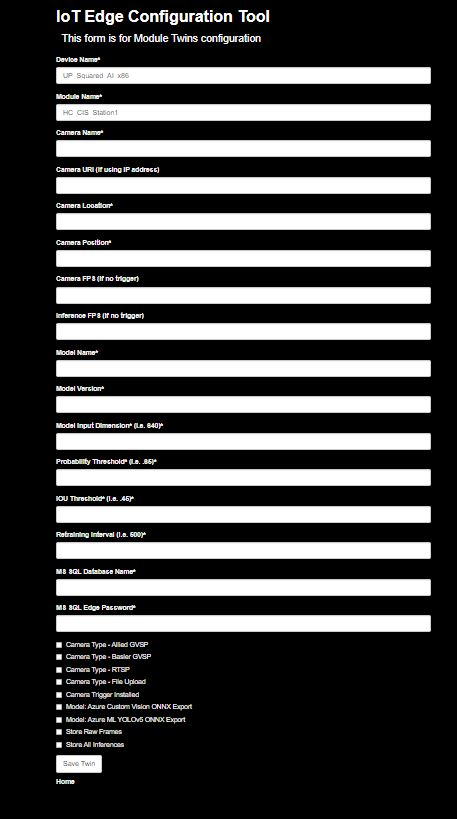

## 5) Set up your Twin Configuration Tool 

Perhaps you noticed, there are two very similar folders in the repository - one inside of the 'modules' folder, labeled 'Mfg_Vision_Twin_Configuration_Tool,' and in the root directory, simply labeled 'Module_Twin_Configuration_Tool.'  The only difference between the two is where you choose to run the containerized application tool.  If you would like to run the configuration tool on your Edge device for testing, you can deploy it as part of your manifest.  If you want to run it locally on your desktop, you can choose other directory - build instructions are located at the top of the dockerfile, as well as run instructions.

If you want an 'easy button' and don't want to build the application container, we've stored a copy in an Azure Container Repository with anonymous pull capabilities.  
Simply run:  

'docker run -d -p 22000:22000 --rm -it visionaccelerator.azurecr.io/iot_edge_configuration_tool:0.0.1-amd64' on your command line or in PowerShell, or add 'sudo' at the beginning if using WSL2.

If you want to run the container and store the config file locally (so you don't have to enter it every time), you could run something like (in WSL2):

'sudo docker run -d -p 22000:22000 --rm -it --mount type=bind,src=/mnt/c/edge_config,dst=/app/config visionaccelerator.azurecr.io/iot_edge_configuration_tool:0.0.1-amd64'

This will create a bind between the /app/config directory in the container to the /mnt/c/edge_config directory on your PC.

In your web browser, open a window and navigate to 'http://localhost:22000'  This will open to the following screen: 

Go ahead and copy/paste the information from your text editor into the appropriate fields - for the CosmosDB name, you can must only use lowercase alphanumeric characters and hyphens for your naming convention.  Click on the 'Save Config' button, and wait for for the following message to appear:

Now click on the 'Home' link at the bottom of the screen - this will take you to the configuration screen.  

You should see your IoT Hub listed as a link in this window.  Click on your IoT Hub and wait for the screen to populate with modules - be patient as this may take some time. Since we're starting from scratch, there won't be any entries quite yet, but when the solution is deployed, the application will cycling through all of modules which have 'CIS' in the name, and you'll end up with a screen that looks like the following:

For illustration, if I select one of the modules listed, a new form will open to configure the module twins

[Back to HoL main](../../Hands-on-Lab.md)
